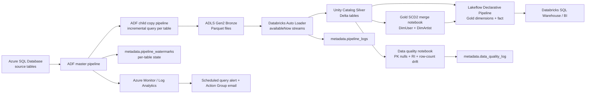

# Spotify Azure Data Engineering Project — Fully Rebuilt

This repository replaces the original tutorial-style implementation with a source-controlled, production-credible build that fixes the broken notebook logic, removes fake CDC, adds metadata-driven incremental ingestion, restores gold-layer engineering, and introduces observability, data quality, and deployment assets.

## What changed

- Removed the single shared `cdc.json` watermark pattern.
- Replaced hardcoded fake incremental SQL with parameterized incremental extraction logic.
- Rebuilt Databricks notebooks as source `.py` files instead of a binary `.dbc` archive.
- Added real SCD Type 2 merge logic for `DimUser` and `DimArtist`.
- Moved `durationFlag` out of silver and into gold.
- Added a Lakeflow Spark Declarative Pipelines notebook for gold tables.
- Added Databricks bundle deployment config.
- Added structured JSON logging and Delta-backed log tables.
- Added data quality validation and Azure Monitor alert deployment.

## Architecture



## Repository layout

- `notebooks/silver/silver_ingestion.py` — Auto Loader ingestion, schema enforcement, idempotent Delta merges, structured logging.
- `notebooks/quality/data_quality_validation.py` — primary key null checks, referential integrity, row-count drift checks.
- `notebooks/gold/gold_scd2_merge.py` — real SCD2 merge for `DimUser` and `DimArtist`.
- `notebooks/gold/gold_dlt_pipeline.py` — Lakeflow gold tables with expectations.
- `notebooks/jinja/jinja_notebook.py` — fixed metadata-driven Jinja SQL rendering.
- `utils/transformations.py` — logging, metadata table bootstrap, repo bootstrap, Delta merge helpers.
- `sql/*.sql` — source schema, metadata tables, incremental extract template, watermark procedure, sample seeds.
- `adf/**/*.json` — ADF linked services, datasets, and pipelines.
- `infra/azure_monitor_alerts.json` — ARM template for diagnostics, action group, and failed-pipeline alert.
- `databricks.yml` — Declarative Automation Bundle config for dev and prod.

## Source schemas

### `dbo.DimUser`
| Column | Type | Key | Notes |
|---|---|---:|---|
| user_id | INT | PK | Natural key |
| user_name | VARCHAR(255) |  | Uppercased in silver |
| country | VARCHAR(255) |  | |
| subscription_type | VARCHAR(50) |  | |
| start_date | DATE |  | Source business date |
| end_date | DATE |  | Source business date |
| updated_at | DATETIME2(0) |  | CDC column |

### `dbo.DimArtist`
| Column | Type | Key | Notes |
|---|---|---:|---|
| artist_id | INT | PK | Natural key |
| artist_name | VARCHAR(255) |  | |
| genre | VARCHAR(100) |  | |
| country | VARCHAR(100) |  | |
| updated_at | DATETIME2(0) |  | CDC column |

### `dbo.DimTrack`
| Column | Type | Key | Notes |
|---|---|---:|---|
| track_id | INT | PK | Natural key |
| track_name | VARCHAR(255) |  | Hyphens normalized in silver |
| artist_id | INT | FK | References `DimArtist.artist_id` |
| album_name | VARCHAR(255) |  | |
| duration_sec | INT |  | |
| release_date | DATE |  | |
| updated_at | DATETIME2(0) |  | CDC column |

### `dbo.DimDate`
| Column | Type | Key | Notes |
|---|---|---:|---|
| date_key | INT | PK | Surrogate calendar key |
| date | DATE |  | |
| day | INT |  | |
| month | INT |  | |
| year | INT |  | |
| weekday | VARCHAR(20) |  | |

### `dbo.FactStream`
| Column | Type | Key | Notes |
|---|---|---:|---|
| stream_id | BIGINT | PK | Event key |
| user_id | INT | FK | References `DimUser.user_id` |
| track_id | INT | FK | References `DimTrack.track_id` |
| date_key | INT | FK | References `DimDate.date_key` |
| listen_duration | INT |  | Must be > 0 |
| device_type | VARCHAR(50) |  | |
| stream_timestamp | DATETIME2(0) |  | CDC column |

## Gold model

### SCD2 dimensions
`DimUser` and `DimArtist` are implemented as SCD Type 2 in `notebooks/gold/gold_scd2_merge.py`.

Surrogate keys use deterministic SHA-256 hashes of the natural key plus the record start timestamp:

- `surrogate_user_key = sha2(user_id || record_start_ts)`
- `surrogate_artist_key = sha2(artist_id || record_start_ts)`

This was chosen instead of `monotonically_increasing_id()` because:
- it is deterministic across retries,
- it survives replays and environment promotion better,
- it is explainable in interviews and easier to validate.

### Gold date enrichment
`gold_dim_date` adds:
- `quarter`
- `fiscal_year`
- `week_number`
- `is_weekend`
- `day_of_year`

### Gold fact design
`gold_fact_stream` joins directly to all dimensions. It enriches the fact with `artist_id` before the dimension joins so the model is no longer forced through a snowflake-only pattern.

## Incremental ingestion pattern

ADF now uses:

1. `metadata.table_configs`
2. `metadata.pipeline_watermarks`
3. a master pipeline lookup query joining configs with current watermarks
4. a child pipeline that runs an incremental SQL query per table
5. success and failure stored-procedure updates on `metadata.usp_update_pipeline_watermark`

### Incremental query shape
```sql
SELECT *
FROM [schema].[table]
WHERE [cdc_column] > @watermark_date
```

This replaces the original fake insert-based “incremental load”.

## Logging and data quality

### Pipeline logs
Databricks writes structured execution logs to:

- `${catalog}.metadata.pipeline_logs`

Fields:
- `event_timestamp`
- `notebook_name`
- `table_name`
- `rows_read`
- `rows_written`
- `duration_seconds`
- `status`
- `error_message`
- `batch_id`
- `run_id`

### Data quality log
The validation notebook writes to:

- `${catalog}.metadata.data_quality_log`

Checks:
- primary key null rate must remain zero
- referential integrity on `FactStream.user_id` and `FactStream.track_id`
- row count delta warning if change exceeds 50% versus last watermark row count

## Deployment

### 1. Azure SQL setup
Run in this order:
1. `sql/001_create_source_schema.sql`
2. `sql/002_metadata_tables.sql`
3. `sql/004_update_watermark_procedure.sql`
4. `sql/005_seed_sample_data.sql`

### 2. Azure resources required
- Azure SQL Database
- Azure Data Factory
- ADLS Gen2
- Azure Databricks with Unity Catalog
- Log Analytics workspace
- Azure Monitor action group

### 3. Databricks config
Update `conf/project_config.json`:
- `storage_account`
- `sql_server`
- `sql_database`
- secret scope/key names
- notification emails

### 4. ADF deployment
Deploy:
- linked services in `adf/linkedServices`
- datasets in `adf/datasets`
- pipelines in `adf/pipelines`

Recommended trigger schedule:
- Bronze ingestion every 15 minutes
- Silver job immediately after ADF bronze load
- Gold SCD2 merge on silver completion
- Gold DLT pipeline on the same cadence or after silver merge
- Data quality notebook directly after silver load

### 5. Azure Monitor alerts
Deploy:
- `infra/azure_monitor_alerts.json`

This:
- enables diagnostic settings for ADF
- routes pipeline/activity/trigger logs to Log Analytics
- creates an action group email receiver
- creates a scheduled query alert on:
  `ADFPipelineRun | where Status == 'Failed'`

### 6. Databricks bundle
Set your host and variables, then run:

```bash
databricks bundle validate --target dev
databricks bundle deploy --target dev
databricks bundle run silver_streaming_job --target dev
```

For prod:

```bash
databricks bundle validate --target prod
databricks bundle deploy --target prod
```

## Security notes

This rebuild removes the original pattern of hardcoding storage names in notebook code and avoids storing passwords in source files. Configure SQL credentials through Databricks secret scopes and parameterize ADF linked services. Private endpoints and Key Vault-backed secrets should be enabled in your Azure environment before production use.

## Operational notes

- Auto Loader uses `failOnNewColumns` so schema drift fails loudly instead of silently mutating downstream tables.
- Streams use `trigger(availableNow=True)` instead of deprecated `once=True`.
- Silver writes use Delta `MERGE` for idempotency.
- The `checkpoint` spelling is corrected everywhere.
- Binary `.dbc` artifacts are replaced with diffable source notebooks.

## Assumptions

- Unity Catalog catalog names differ by environment.
- ADLS containers are named `bronze`, `silver`, and `gold`.
- ADF writes parquet files to bronze.
- Databricks jobs run with permissions to read ADLS and write Unity Catalog tables.
- The alert action group uses email; a Logic App webhook is parameterized for ADF failure callbacks.


## Security hardening update

- Azure Data Factory SQL connectivity is designed to read the full SQL connection string from Azure Key Vault through `LS_AzureKeyVault` and `LS_AzureSql_SpotifySource`, so SQL credentials are no longer passed through pipeline parameters.
- The recommended deployment path is: create the Key Vault secret `spotify-azure-sql-connection-string`, grant the factory managed identity `Get` permission, then import the linked service JSON as-is.

## Orchestration hardening update

- The Databricks bundle now contains `gold_modeling_job`, which runs `gold_scd2_merge.py` first and then refreshes the Lakeflow gold pipeline. This closes the earlier dependency gap between SCD2 tables and the gold pipeline.

## CI update

- `.github/workflows/ci.yml` runs static tests on every push/PR and optionally runs `databricks bundle validate` when Databricks secrets are configured in GitHub Actions.


## Screenshots

End-to-end proof that every layer ran successfully.

| # | Screenshot | What it proves |
|---|---|---|
| 1 |  | Real Azure infrastructure provisioned |
| 2 |  | Medallion data lake layers created |
| 3 |  | ADF physically landed data in bronze |
| 4 |  | Incremental ingestion pipeline succeeded |
| 5 |  | All 5 tables individually ingested |
| 6 |  | Incremental watermark framework ran |
| 7 |  | Bronze to Silver transformation complete |
| 8 |  | 12 of 12 data quality checks pass |
| 9 |  | Gold DLT serverless pipeline completed |
| 10 |  | SHA256 SCD2 dimensional modeling |
