# Spotify Azure End-to-End Data Engineering Pipeline

[](https://github.com/AyushButoliya/spotify-azure-data-engineering/actions/workflows/ci.yml)


A production-pattern data engineering pipeline built entirely on Azure and Databricks — from raw SQL source to analytics-ready gold tables. Incremental watermark ingestion via ADF, schema-on-read bronze landing, Auto Loader streaming to Delta silver, SHA256-based SCD2 dimensions, and a Delta Live Tables pipeline for the final gold layer. Unity Catalog governs everything. 21 live screenshots prove every layer ran.

---

## About This Project

I built this project to get hands-on with the full Azure data engineering stack — not just knowing what these services are, but actually wiring them together end to end and understanding where things break and why.

The part that took me the longest to get right was the Unity Catalog setup. Getting the Access Connector, the storage credential, and the external locations all correctly linked so that Databricks could actually read and write to ADLS Gen2 via `abfss://` paths required a lot of debugging. RBAC assignments in Azure don't take effect instantly, and I wasted more than a few runs chasing what turned out to be a missing Storage Blob Data Contributor role on the Access Connector.

The SCD2 implementation is something I'm particularly proud of. Using SHA256 hashing to detect attribute changes instead of column-by-column comparisons is cleaner at scale, and caching the `changed_or_new` DataFrame before the two-phase merge (expire + append) to avoid Spark re-evaluation was a non-obvious fix that I had to reason through carefully.

**Dataset scope:** This project uses a seeded sample dataset — 5 users, 5 artists, 5 tracks, 145 dates, and 10 streaming events. The goal was to validate every layer of the pipeline mechanics correctly, not to process volume. All the patterns — watermarking, SCD2, Auto Loader, DLT expectations, Unity Catalog governance — are production-grade and would scale to a real dataset without architectural changes.

---

## Architecture

```
┌─────────────────────────────────────────────────────────────────────────────────┐
│                        AZURE SQL SERVER (Source)                                │
│   spotify_source  ·  dbo.DimUser  ·  dbo.DimArtist  ·  dbo.DimTrack           │
│   dbo.DimDate  ·  dbo.FactStream  ·  metadata.table_configs                    │
│   metadata.pipeline_watermarks  ·  metadata.usp_update_pipeline_watermark      │
└───────────────────────────────┬─────────────────────────────────────────────────┘
                                │  Incremental extract
                                │  WHERE cdc_column > last_load_timestamp
                                ▼
┌─────────────────────────────────────────────────────────────────────────────────┐
│                   AZURE DATA FACTORY  (adf-sptfy-dataops-5391)                  │
│                                                                                 │
│  PL_Spotify_Ingest_Master                                                       │
│  ┌────────────────────┐    ┌────────────────────┐    ┌─────────────────────┐   │
│  │ Lookup_Table_Config│───▶│  ForEach_Table      │───▶│ Execute_Copy_Table  │   │
│  │ _With_Watermark    │    │  (Sequential x5)    │    │ _Pipeline           │   │
│  └────────────────────┘    └────────────────────┘    └─────────────────────┘   │
│                                                                                 │
│  PL_Spotify_Copy_Table  (per-table child pipeline)                              │
│  Get_Webhook_Secret ──▶ Copy_Incremental_To_Bronze ──▶ Lookup_Max_             │
│                                                        Watermark_And_RowCount   │
│                              └─(Success)─▶ Update_Watermark_Success            │
│                              └─(Failure)─▶ Update_Watermark_Failure            │
│  Auth: Managed Identity → Key Vault (MSI, secureOutput=true)                   │
└───────────────────────────────┬─────────────────────────────────────────────────┘
                                │  Parquet files → ADLS Gen2 bronze container
                                ▼
┌─────────────────────────────────────────────────────────────────────────────────┐
│              AZURE DATA LAKE STORAGE GEN2  (stsptfydata5391)                   │
│              Hierarchical Namespace  ·  abfss:// paths                          │
│                                                                                 │
│  bronze/          silver/          gold/           ucroot/                      │
│  ├── DimArtist/   (Delta tables)   (Delta tables)  (Unity Catalog root)         │
│  ├── DimDate/     written by       written by                                   │
│  ├── DimTrack/    Databricks       Databricks                                   │
│  ├── DimUser/     silver job       gold jobs                                    │
│  └── FactStream/                                                                │
│      *.parquet                                                                  │
└───────────────────────────────┬─────────────────────────────────────────────────┘
                                │  Auto Loader (cloudFiles/parquet)
                                │  trigger(availableNow=True)
                                ▼
┌─────────────────────────────────────────────────────────────────────────────────┐
│                    DATABRICKS  (dbw-sptfy-dataops-5391)                         │
│                    Runtime 13.3 LTS  ·  Unity Catalog: spotify_cata_dev         │
│                    Cluster: spotify-manual  ·  Standard_D4ds_v5  ·  Single Node │
│                                                                                 │
│  SILVER  (silver_ingestion.py)                                                  │
│  ┌──────────────────────────────────────────────────────────────────────┐       │
│  │  cloudFiles ──▶ normalise_columns ──▶ deduplicate_latest             │       │
│  │               ──▶ merge_batch_to_delta (UPSERT by PK)               │       │
│  │  5 Delta tables: DimUser · DimArtist · DimTrack · DimDate · FactStream│      │
│  └──────────────────────────────────────────────────────────────────────┘       │
│                                                                                 │
│  DATA QUALITY  (data_quality_validation.py)                                     │
│  ┌──────────────────────────────────────────────────────────────────────┐       │
│  │  PK null-rate check (per table) + Referential integrity (FactStream) │       │
│  │  + Row-count delta check  → metadata.data_quality_log (12/12 PASS)  │       │
│  └──────────────────────────────────────────────────────────────────────┘       │
│                                                                                 │
│  GOLD SCD2  (gold_scd2_merge.py)                                                │
│  ┌──────────────────────────────────────────────────────────────────────┐       │
│  │  attribute_hash = SHA256(user_name || country || subscription_type)  │       │
│  │  Detect changes ──▶ Expire old record (is_current=False, end_date)  │       │
│  │  ──▶ Append new record (surrogate_key = SHA256(user_id || ts))      │       │
│  │  dim_user_scd2 · dim_artist_scd2                                    │       │
│  └──────────────────────────────────────────────────────────────────────┘       │
│                                                                                 │
│  GOLD DLT  (gold_dlt_pipeline.py)  ·  Delta Live Tables Lakeflow Pipeline      │
│  ┌──────────────────────────────────────────────────────────────────────┐       │
│  │  @dlt.table  gold_dim_user   ←── dim_user_scd2                     │       │
│  │  @dlt.table  gold_dim_artist ←── dim_artist_scd2                   │       │
│  │  @dlt.table  gold_dim_track  ←── silver DimTrack + durationFlag    │       │
│  │  @dlt.table  gold_dim_date   ←── silver DimDate + quarter/fiscal   │       │
│  │  @dlt.table  gold_fact_stream ←── FactStream ⋈ all dims (all keys) │       │
│  │  @dlt.expect_or_fail("user_id_not_null", "user_id IS NOT NULL")    │       │
│  │  @dlt.expect_or_fail("listen_duration_positive", "listen_duration > 0")│    │
│  └──────────────────────────────────────────────────────────────────────┘       │
└─────────────────────────────────────────────────────────────────────────────────┘

Secret management: Azure Key Vault (kv-sptfy-dataops-5391)
                   ADF: MSI → KV · Databricks: secret scope kv-secrets
RBAC: ADF Managed Identity → Storage Blob Data Contributor + KV Secrets User
      Access Connector (ac-sptfy-db-5391) → Storage Blob Data Contributor
```

---

## Proof of Execution

All screenshots below are taken from the live deployed Azure and Databricks environment on 2026-03-31.

### Azure Infrastructure

**Resource Group — all services provisioned under a single resource group in North Europe**

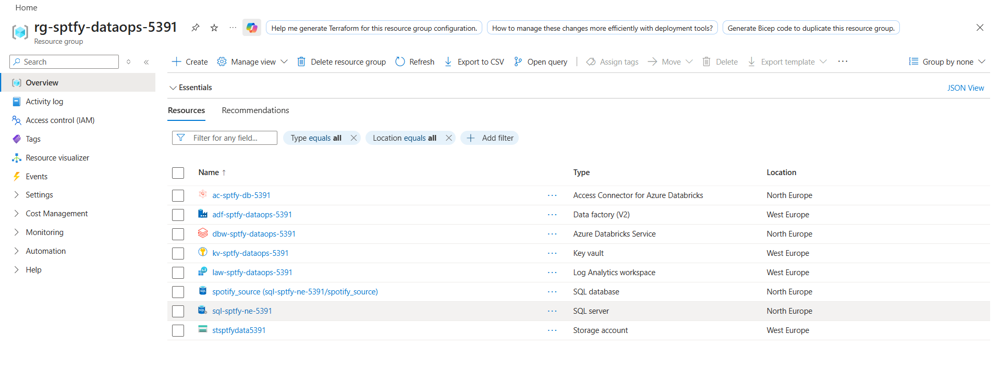

**ADLS Gen2 — Hierarchical Namespace enabled, four containers for medallion layers + Unity Catalog root**

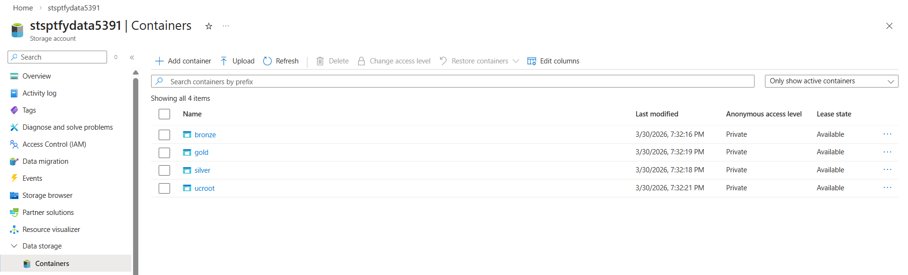

**Bronze Layer — ADF extracted and landed parquet files for all 5 tables. Multiple parquet files in DimArtist confirm the pipeline ran on separate occasions.**

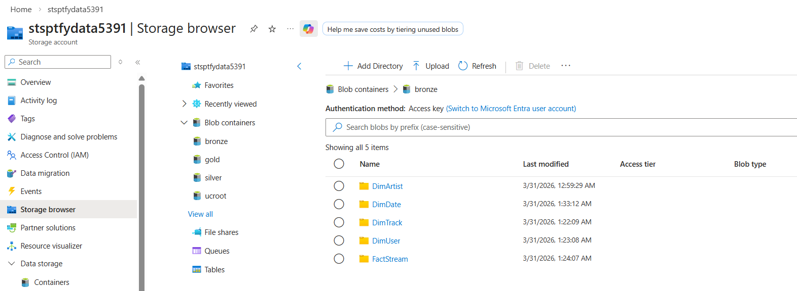
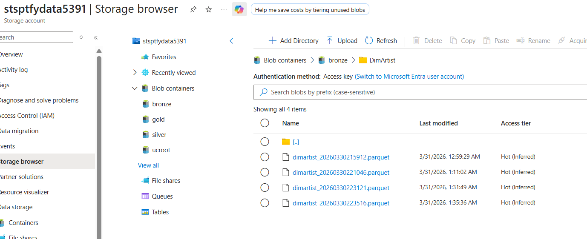

**Key Vault — Secret names visible, values never exposed. ADF reads the SQL connection string via MSI at runtime.**

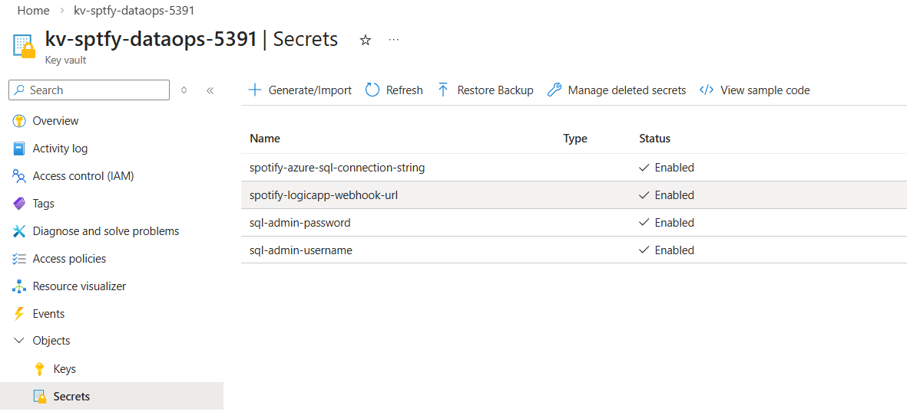

---

### ADF Ingestion Pipeline

**Pipeline design — `Lookup_Table_Config_With_Watermark` → `ForEach_Table` → `Execute_Copy_Table_Pipeline`**

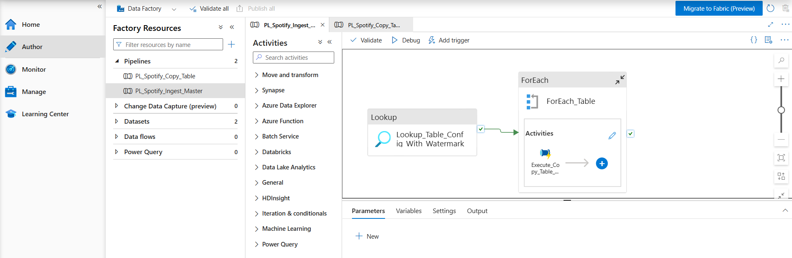

**Master pipeline run — Succeeded, 5 min 11 sec, Run ID: `9d00cafa-2c88-11f1-9cf1-94e23ca3a916`**

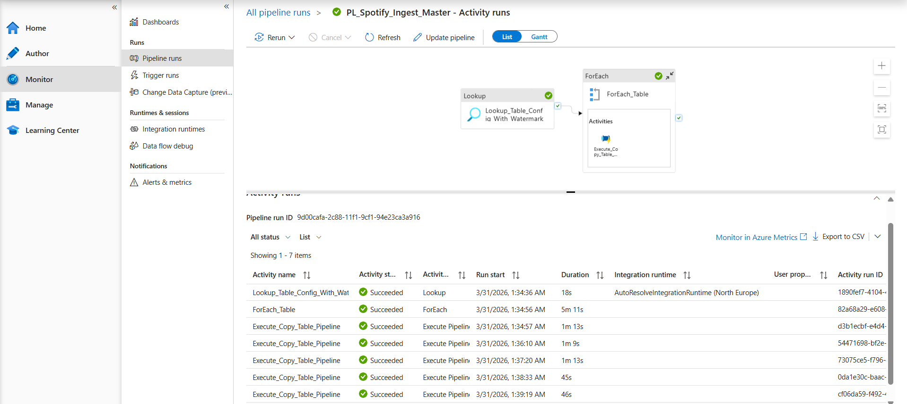

**ForEach iterations — all 5 tables individually Succeeded**

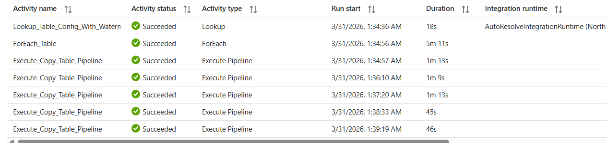

---

### SQL — Metadata Framework and Source Data

**Metadata tables — the full framework: `table_configs`, `pipeline_watermarks`, `pipeline_logs`, `data_quality_log`**

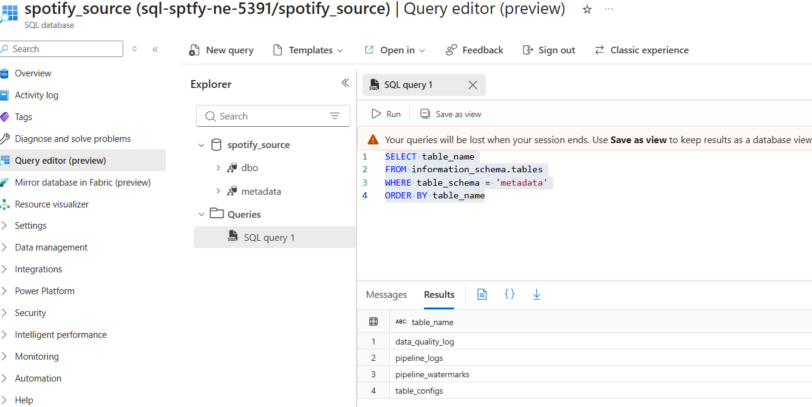

**Watermark table after ADF run — 5 rows, all `SUCCESS`. Timestamps from the live run on 2026-03-30. NULL timestamps on DimDate/DimUser/FactStream mean incremental copy returned 0 rows on a re-run because no records had changed since the watermark — data is already in bronze.**

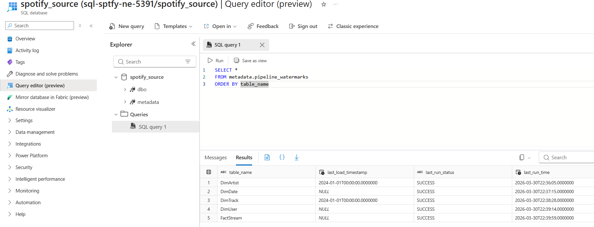

**Source row counts — DimArtist=5, DimDate=145, DimTrack=5, DimUser=5, FactStream=10. This is a seeded sample dataset used to validate pipeline mechanics end to end.**

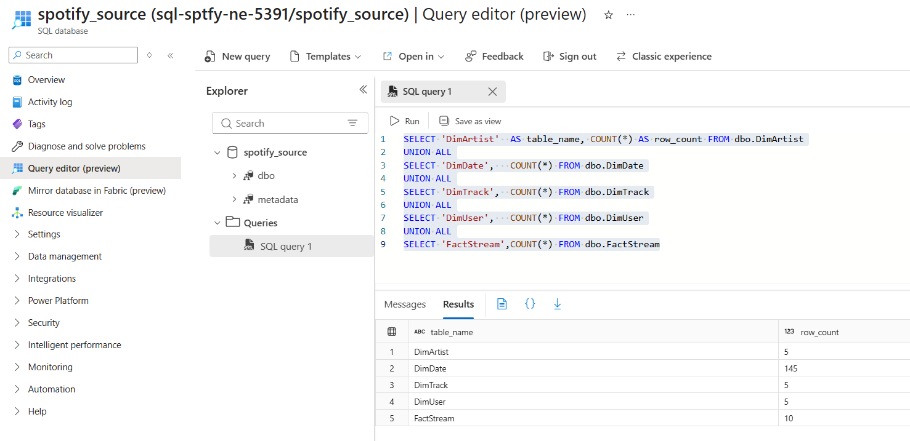

---

### Databricks — Silver, Quality, Gold

**Data quality log — 12 checks, all PASS. PK null rates, referential integrity (user_id, track_id), row count delta. Stored in `spotify_cata_dev.metadata.data_quality_log`.**

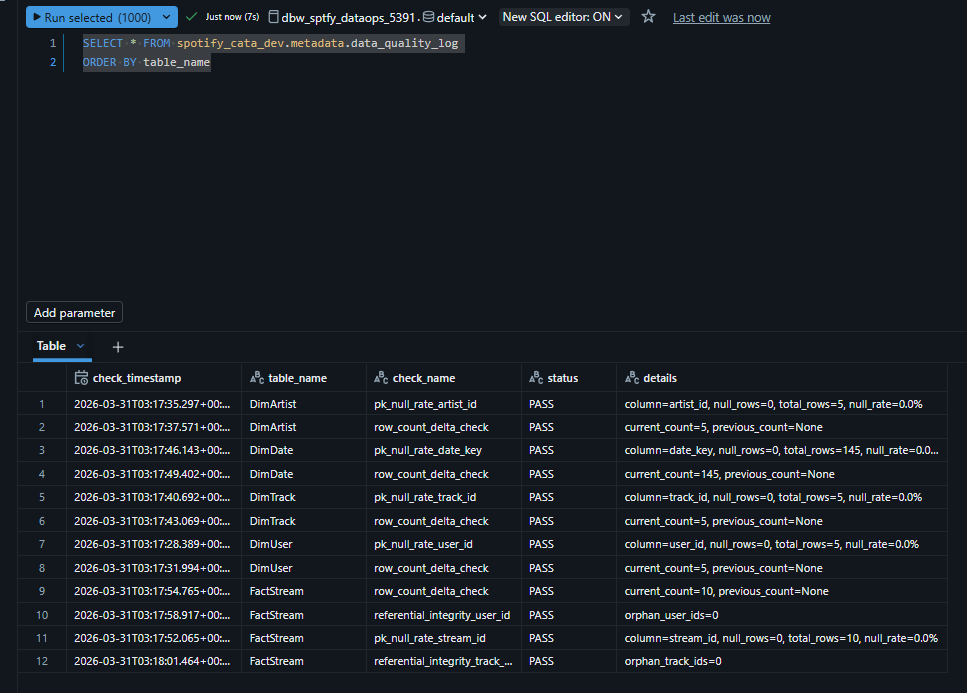

**Pipeline execution log — silver_ingestion x5 tables + gold_scd2_merge all SUCCESS. rows_read, rows_written, duration_seconds all recorded.**

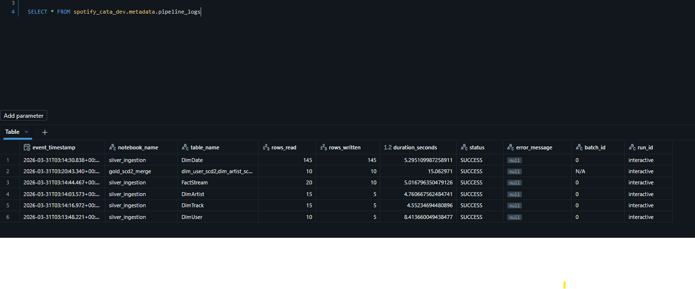

**Unity Catalog — `spotify_cata_dev` with silver, gold, metadata schemas**

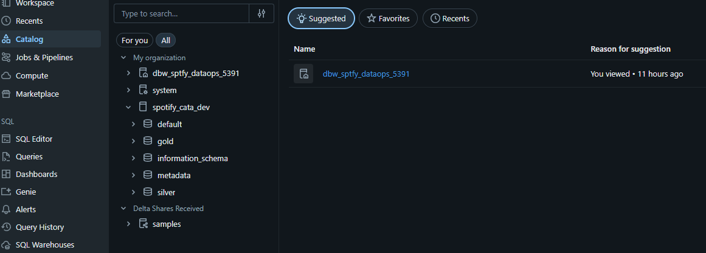

**Silver tables — all 5 Delta tables created via MERGE from bronze parquet**

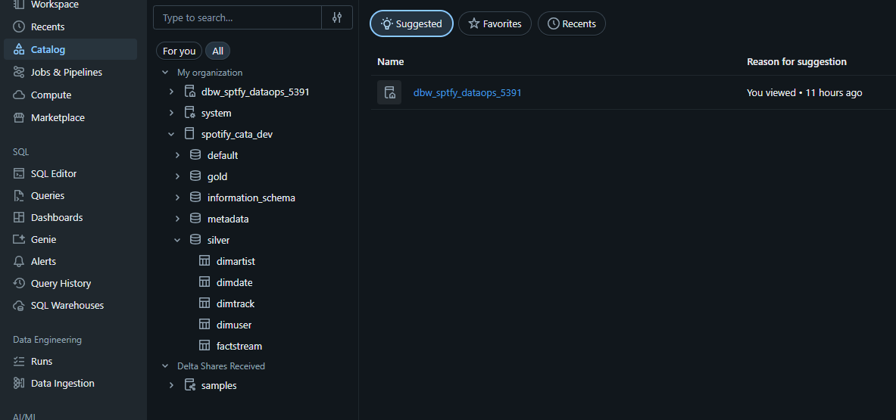

**Silver sample data — actual artist rows in DimArtist: The Weeknd, Taylor Swift, Drake, Billie Eilish, Ed Sheeran**

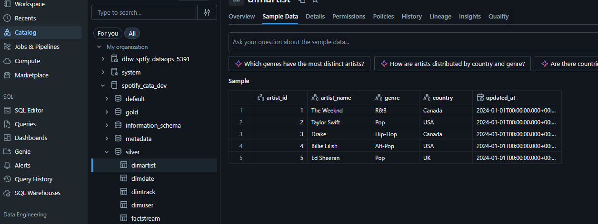

**Gold tables in Unity Catalog — DLT materialized views + SCD2 dimensions, all in `spotify_cata_dev.gold`**

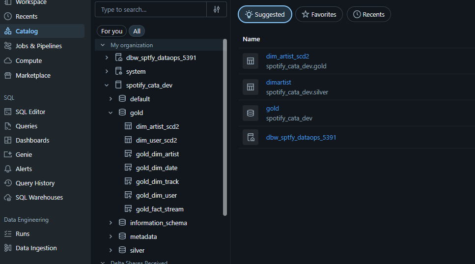

**Gold DLT pipeline — Completed, Mar 31 2026 06:57 AM. All 5 materialized views created. 2 expectations met on `gold_fact_stream`.**

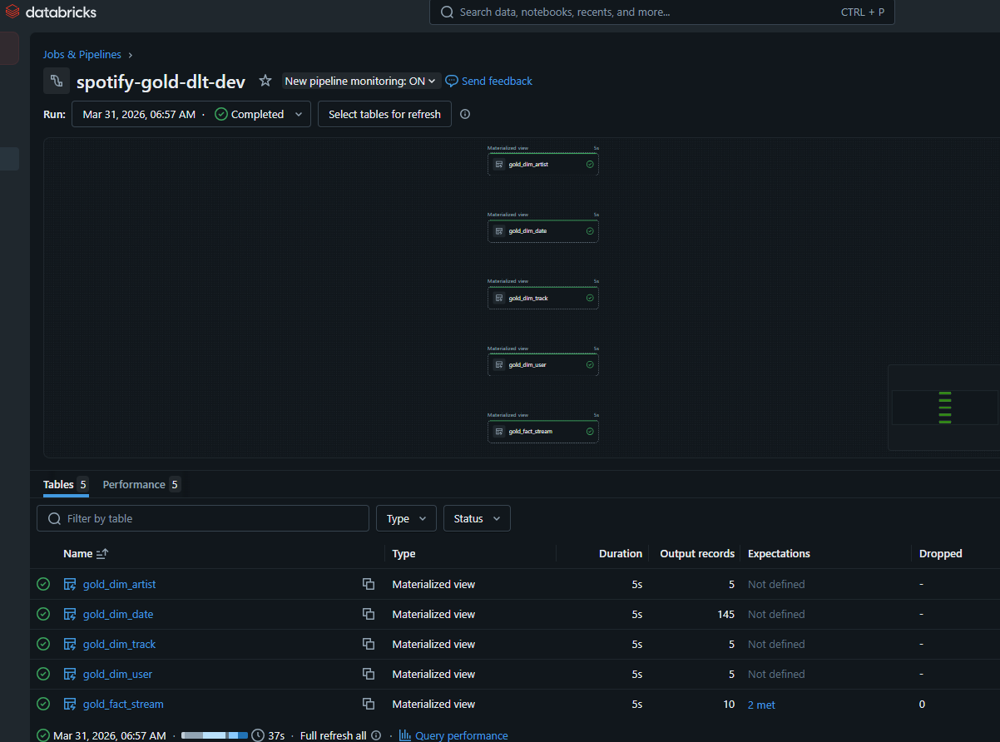

**SCD2 dimension — `dim_user_scd2` with full SHA256 surrogate keys, user attributes, subscription type, is_current flag**

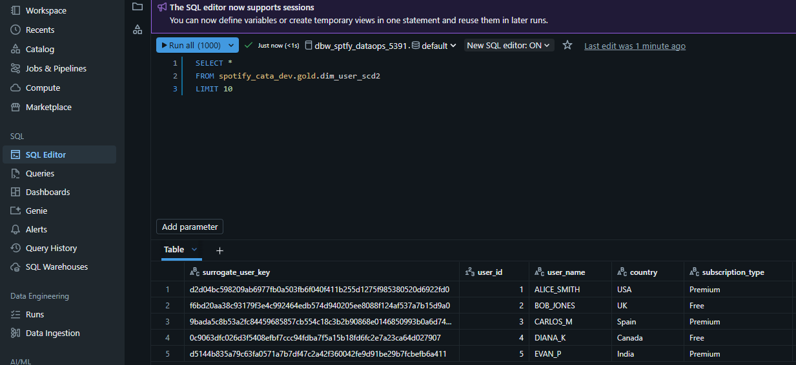

**Gold fact table — `gold_fact_stream` with all dimension surrogate keys resolved: user_key, artist_key, track_key, date_dim_key**

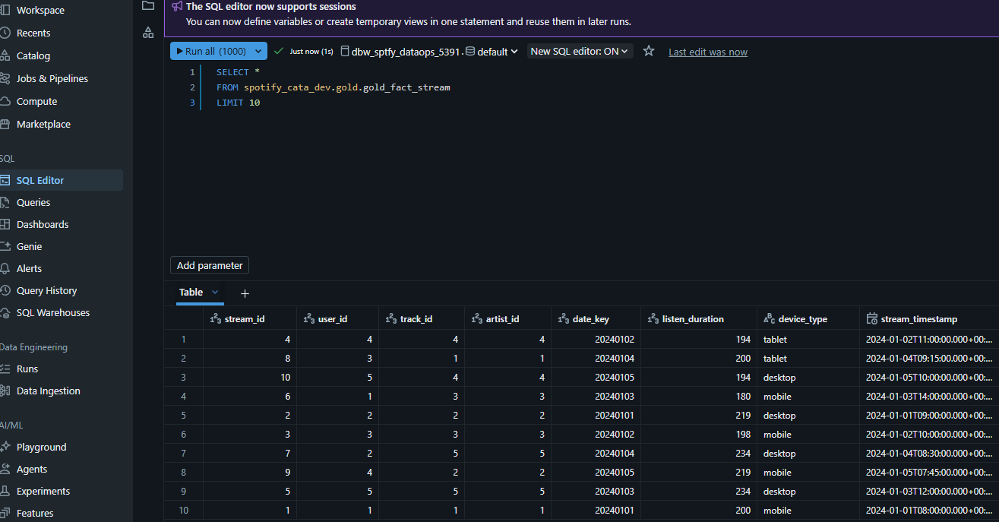

**Databricks cluster `spotify-manual` — Runtime 13.3 LTS, Standard_D4ds_v5, Single Node. All silver, quality, and gold notebooks were executed on this cluster.**

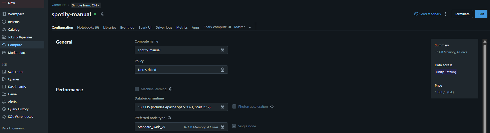

---

## Tech Stack

| Layer | Service | Purpose |
|---|---|---|
| Source | Azure SQL Database | Relational source, metadata schema, watermark tracking |
| Ingestion | Azure Data Factory | Incremental watermark copy, ForEach orchestration |
| Secret management | Azure Key Vault | SQL connection string, all secrets |
| Storage | ADLS Gen2 (HNS enabled) | bronze / silver / gold / ucroot containers |
| Compute | Databricks Premium on Azure | Silver, quality, gold notebook and pipeline runs |
| Governance | Unity Catalog | `spotify_cata_dev`, 3 schemas, external locations, storage credentials |
| Silver format | Delta Lake | MERGE (UPSERT) via Auto Loader trigger |
| Gold SCD2 | Delta Lake + PySpark | Hash-based change detection, two-phase merge + append |
| Gold pipeline | Delta Live Tables | 5 materialized views, DLT expectations |
| Deployment | Databricks Asset Bundles (DABs) | Bundle validate + deploy, 2 jobs + 1 DLT pipeline |
| CI | GitHub Actions | pytest + databricks bundle validate on PR |
| Auth | Azure Managed Identity | ADF MSI → KV + ADLS, Access Connector → ADLS |
| Secrets (Databricks) | Databricks secret scope (`kv-secrets`) | SQL credentials for notebook use |

---

## Project Structure

```
spotify-azure-data-engineering/
│
├── notebooks/
│   ├── silver/
│   │   └── silver_ingestion.py          # Auto Loader → normalise → dedup → MERGE
│   ├── gold/
│   │   ├── gold_scd2_merge.py           # SCD2 for DimUser + DimArtist
│   │   └── gold_dlt_pipeline.py         # DLT pipeline, 5 @dlt.table definitions
│   ├── quality/
│   │   └── data_quality_validation.py   # PK nulls + referential integrity + row drift
│   └── jinja/
│       └── jinja_notebook.py            # Templating utility
│
├── utils/
│   └── transformations.py               # NotebookLogger, ABFSS path builder,
│                                        # normalise_columns, deduplicate_latest,
│                                        # merge_batch_to_delta, persist_pipeline_log,
│                                        # persist_quality_log, Delta operation metrics
│
├── adf/
│   ├── pipelines/
│   │   ├── pl_spotify_ingest_master.json  # Lookup → ForEach → Execute child
│   │   └── pl_spotify_copy_table.json     # Get secret → Copy → Watermark update
│   ├── datasets/
│   │   ├── ds_sql_incremental_query.json
│   │   └── ds_bronze_parquet_sink.json
│   └── linkedServices/
│       ├── ls_key_vault.json
│       ├── ls_adls.json                   # MSI auth, RBAC documented
│       └── ls_sql_source.json             # Connection string from KV
│
├── sql/
│   ├── 001_create_source_schema.sql     # DimUser, DimArtist, DimTrack, DimDate, FactStream
│   ├── 002_metadata_tables.sql          # table_configs, pipeline_watermarks + seed data
│   ├── 003_incremental_extract_template.sql
│   ├── 004_update_watermark_procedure.sql  # usp_update_pipeline_watermark (MERGE)
│   └── 005_seed_sample_data.sql
│
├── conf/
│   ├── project_config.json              # Catalog, schemas, storage account, secret scope
│   └── table_configs.json               # Per-table: PKs, CDC column, paths, partitioning
│
├── infra/
│   └── azure_monitor_alerts.json        # ARM template for ADF failure alert
│
├── tests/
│   └── test_project_structure.py        # 12 static tests: file existence, YAML structure,
│                                        # ADF secret patterns, DLT import, merge metrics
│
├── docs/
│   ├── screenshots/                     # 21 proof screenshots
│   └── verification_checklist.md
│
├── .github/workflows/ci.yml             # pytest + databricks bundle validate
├── databricks.yml                       # DABs: 2 jobs + 1 DLT pipeline
└── pytest.ini
```

---

## Data Model

### Source Schema (Azure SQL)

```
dbo.DimUser          dbo.DimArtist        dbo.DimTrack
────────────         ─────────────        ────────────
user_id (PK)         artist_id (PK)       track_id (PK)
user_name            artist_name          track_name
country              genre                artist_id (FK → DimArtist)
subscription_type    country              album_name
start_date           updated_at           duration_sec
end_date                                  release_date
updated_at                                updated_at

dbo.DimDate          dbo.FactStream
───────────          ──────────────
date_key (PK)        stream_id (PK)
date                 user_id   (FK → DimUser)
day                  track_id  (FK → DimTrack)
month                date_key  (FK → DimDate)
year                 listen_duration
weekday              device_type
                     stream_timestamp
```

> **Dataset note:** Source tables are seeded with a sample dataset (DimUser: 5 rows, DimArtist: 5, DimTrack: 5, DimDate: 145, FactStream: 10). This scope is intentional — the goal is to prove every pipeline layer executes correctly and produces the right output structure, not to demonstrate data volume.

### Gold Schema (Unity Catalog: `spotify_cata_dev.gold`)

```
dim_user_scd2                            dim_artist_scd2
─────────────                            ───────────────
surrogate_user_key   SHA256(user_id||ts) surrogate_artist_key  SHA256(artist_id||ts)
user_id                                  artist_id
user_name                                artist_name
country                                  genre
subscription_type                        country
source_start_date                        source_updated_at
source_end_date                          start_date / end_date
source_updated_at                        is_current (BOOLEAN)
start_date / end_date                    attribute_hash        SHA256(name||genre||country)
is_current (BOOLEAN)                     record_start_ts / record_end_ts
attribute_hash        SHA256(name||country||sub)
record_start_ts / record_end_ts

gold_fact_stream  (DLT materialized view)
─────────────────
stream_id, user_id, track_id, artist_id, date_key
listen_duration, device_type, stream_timestamp, event_date
user_key       → surrogate_user_key from dim_user_scd2
artist_key     → surrogate_artist_key from dim_artist_scd2
track_key      → SHA256(track_id || updated_at)
date_dim_key   → SHA256(date_key)
```

---

## Layer-by-Layer Breakdown

### Source — Azure SQL

Five tables in `dbo` schema with FK relationships enforced at the database level. The `metadata` schema holds the pipeline control framework: `table_configs` (which tables to ingest and on which CDC column) and `pipeline_watermarks` (the last successful load timestamp per table). The stored procedure `usp_update_pipeline_watermark` is a MERGE-based upsert called by ADF at the end of each table copy.

SQL scripts in `sql/` are ordered and idempotent — re-running any of them is safe.

### Bronze — ADF Incremental Watermark Copy

`PL_Spotify_Ingest_Master` starts with a single Lookup activity that joins `metadata.table_configs` with `metadata.pipeline_watermarks` and returns the last watermark per active table. The result feeds a sequential ForEach that invokes `PL_Spotify_Copy_Table` once per table.

`PL_Spotify_Copy_Table` runs four activities:

1. `Get_Webhook_Secret` — Web activity that retrieves a secret from Azure Key Vault using ADF Managed Identity (`secureOutput=true`). This activity is scaffolded for an optional alerting webhook and demonstrates the correct MSI-based pattern for calling the Key Vault REST API from ADF at runtime — no credentials in pipeline parameters.
2. `Copy_Incremental_To_Bronze` — Reads from SQL with `WHERE cdc_column > @watermark_date`, writes timestamped parquet to `bronze/<TableName>/<tablename>_<timestamp>.parquet`.
3. `Lookup_Max_Watermark_And_RowCount` — Reads the MAX value of the CDC column from the just-copied data.
4. `Update_Watermark_Success` / `Update_Watermark_Failure` — Two stored procedure activities that call `metadata.usp_update_pipeline_watermark` with either `SUCCESS` or `FAILURE` status depending on the Copy outcome.

The SQL connection string is stored in Key Vault and referenced as `AzureKeyVaultSecret` in `ls_sql_source.json`. No credentials ever appear in pipeline parameters.

### Silver — Databricks Auto Loader

`silver_ingestion.py` iterates `table_configs.json` and for each table:

- Opens a `cloudFiles` stream from the bronze parquet folder with `schemaEvolutionMode: failOnNewColumns` and a `rescuedDataColumn` to catch any unexpected fields
- Runs `trigger(availableNow=True)` — processes all available files exactly once, then stops
- In `process_microbatch`: normalises columns (`normalise_columns` handles DimUser uppercasing, DimTrack hyphen replacement, FactStream event_date derivation), deduplicates by PK using a Window function ordered by the CDC column, then calls `merge_batch_to_delta` which does an `INSERT INTO` on first run and a `MERGE` (UPSERT by PK) on subsequent runs
- Every run writes a structured row to `metadata.pipeline_logs` — success or failure, with rows_read, rows_written, duration_seconds

DimDate partitions by `year, month`. FactStream partitions by `event_date`. Other tables have no partitioning.

### Data Quality

`data_quality_validation.py` runs three check categories against the silver layer:

**PK null-rate check** — For each table, counts NULL occurrences in each primary key column. Any NULL fails hard and raises immediately.

**Row-count delta check** — Compares current row count against the last recorded count. A delta greater than 50% logs a WARNING without blocking the load — catching catastrophic drops while allowing normal growth.

**Referential integrity** — `FactStream.user_id` and `FactStream.track_id` are left-anti-joined against `DimUser` and `DimTrack`. Any orphan keys fail hard with the offending rows printed.

All results are appended to `spotify_cata_dev.metadata.data_quality_log`. Result: **12/12 PASS**.

### Gold SCD2 — Slowly Changing Dimensions

`gold_scd2_merge.py` implements Type 2 SCD for `DimUser` and `DimArtist` using a two-phase approach:

**Phase 1 — Detect changes.** For each dimension, compute `attribute_hash = SHA256(concat of tracked columns)` on the silver source. Left-join against the current target (`is_current = True`). Select rows where the target has no match (new record) or where the hashes differ (changed record).

**Phase 2 — Apply.** If no changes, exit early. Otherwise:
- `DeltaTable.merge` on the `is_current` records with matching business key → `whenMatchedUpdate` sets `end_date`, `is_current=False`, `record_end_ts`
- `write.mode("append")` for all changed/new rows with freshly computed `surrogate_key = SHA256(business_key || record_start_ts)`, `is_current=True`, `end_date=None`

The `changed_or_new` DataFrame is cached and materialized with `.count()` before the merge to avoid Spark re-evaluation between the expire and insert phases.

### Gold DLT — Delta Live Tables Pipeline

`gold_dlt_pipeline.py` defines 5 `@dlt.table` materialized views, all run via the Lakeflow pipeline `spotify-gold-dlt-dev`:

- `gold_dim_user` and `gold_dim_artist` read the full SCD2 table snapshot. The `is_current` filter is applied inside `gold_fact_stream` when resolving surrogate keys for the fact table join.
- `gold_dim_track` adds a computed `durationFlag` column: `< 150s → low`, `< 300s → medium`, `>= 300s → high`
- `gold_dim_date` adds `quarter`, `fiscal_year`, `week_number`, `is_weekend`, `day_of_year` using PySpark date functions
- `gold_fact_stream` joins FactStream to all four dimension tables and resolves surrogate keys for all FK columns. Two `@dlt.expect_or_fail` constraints enforce data integrity: `user_id IS NOT NULL` and `listen_duration > 0`

Pipeline configuration (`catalog_name`, `silver_schema`, `gold_schema`) is passed via `spark.conf` from the bundle and read at runtime with `spark.conf.get(key, project_config_default)`.

---

## Infrastructure

All resources deployed under resource group `rg-sptfy-dataops-5391`, North Europe. Key Vault is in West Europe — a deliberate cross-region placement to keep secrets in a separate failure domain.

```
Resource                         Name                          Location
─────────────────────────────    ─────────────────────────     ─────────────
Storage Account (ADLS Gen2)      stsptfydata5391               North Europe
  Containers                     bronze / silver / gold / ucroot
Azure SQL Server                 sql-sptfy-ne-5391             North Europe
  Database                       spotify_source
Azure Key Vault                  kv-sptfy-dataops-5391         West Europe
Azure Data Factory               adf-sptfy-dataops-5391        North Europe
Databricks Workspace             dbw-sptfy-dataops-5391        North Europe
  Unity Catalog                  spotify_cata_dev
  Schemas                        silver / gold / metadata
Access Connector                 ac-sptfy-db-5391              North Europe
```

**RBAC assignments:**

| Principal | Role | Scope |
|---|---|---|
| ADF Managed Identity | Key Vault Secrets User | kv-sptfy-dataops-5391 |
| ADF Managed Identity | Storage Blob Data Contributor | stsptfydata5391 |
| Current user | Key Vault Secrets Officer | kv-sptfy-dataops-5391 |

Unity Catalog storage credential `sc_sptfy` uses the Access Connector. External locations cover all four containers via `abfss://` paths. The `ucroot` container is the managed storage root for `spotify_cata_dev`.

---

## Deployment

### Prerequisites

- Databricks CLI v0.200+ (`winget install Databricks.DatabricksCLI`)
- Databricks PAT token configured in `~/.databrickscfg`
- Python 3.11, pytest, pyyaml (for local test run)

### 1 — Run static tests locally

```bash
pytest -q
```

Runs 12 structural tests: file existence, table config schema, bundle job orchestration, ADF KV secret patterns, SCD2 cache correctness, DLT import, merge metrics helper, CI workflow contents.

### 2 — Deploy the bundle

```bash
cd <project-root>
databricks bundle validate --target dev
databricks bundle deploy --target dev
```

This uploads notebooks, utils, conf, and SQL to the Databricks workspace and registers 2 jobs + 1 DLT pipeline.

### 3 — Run notebooks

Create a Databricks cluster (Single Node, 13.3 LTS, Standard_D4ds_v5) and add this bootstrap cell at the top of each notebook:

```python
import sys, os
bundle_root = "/Workspace/Users/<your-email>/.bundle/spotify_azure_project_fixed/dev/files"
if bundle_root not in sys.path:
    sys.path.insert(0, bundle_root)
os.chdir(bundle_root)
spark.sql("USE CATALOG spotify_cata_dev")
```

Run in order:
1. `notebooks/silver/silver_ingestion.py`
2. `notebooks/quality/data_quality_validation.py`
3. `notebooks/gold/gold_scd2_merge.py`
4. `Jobs & Pipelines → spotify-gold-dlt-dev → Run pipeline with full table refresh`

### 4 — SQL setup (if starting fresh)

Run `sql/` scripts in numbered order against the Azure SQL database using Query Editor or SSMS. `001` creates and seeds the source schema. `002` creates the metadata framework. `005` seeds sample data.

---

## CI/CD

`.github/workflows/ci.yml` runs on every push to `main`/`master` and on every pull request:

1. **Static tests** — `pytest -q` against 12 test cases in `tests/test_project_structure.py`
2. **Bundle validation** — `databricks bundle validate` using `DATABRICKS_HOST` and `DATABRICKS_TOKEN` repository secrets

The CI pipeline validates structure and configuration correctness on every commit, keeping the codebase deployable at all times.

---

## Author

**Ayush Butoliya**

*Last updated: 2026-03-31 · All screenshots taken from the live deployed environment on the same date.*
